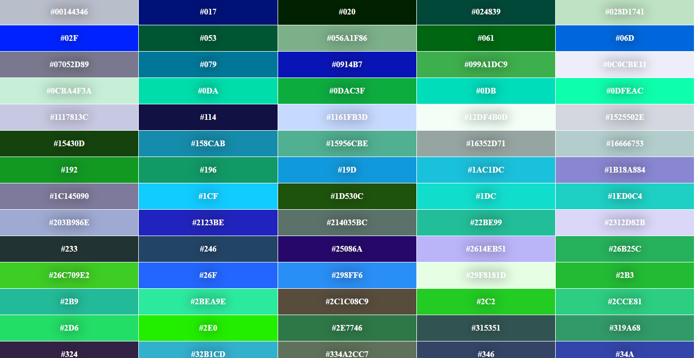

# Gerador de Cores

[![license Mit][license]](https://opensource.org/licenses/MIT)
[![Version][tag]](https://github.com/joaoazevedoJS/GeradorDeCores/releases/tag/1.0.0)
[![last commit][Last Commit]](https://github.com/joaoazevedoJS/GeradorDeCores/commits/1.0.0)

Gerador que cria uma paleta de cores!  
Imagem de Exemplo:

> Para mudar as cores, de **CTRL + R**

[license]: https://img.shields.io/github/license/joaoazevedoJS/GeradorDeCores

[tag]: https://img.shields.io/github/v/tag/joaoazevedoJS/GeradorDeCores?color=00ff

[last commit]: https://img.shields.io/github/last-commit/joaoazevedoJS/GeradorDeCores
